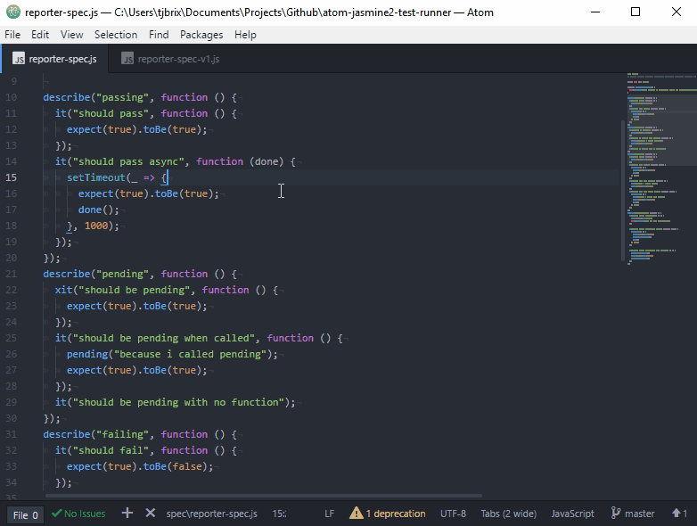

[](https://travis-ci.org/UziTech/atom-jasmine2-test-runner)
[](https://ci.appveyor.com/project/UziTech/atom-jasmine2-test-runner/branch/master)
[](https://david-dm.org/UziTech/atom-jasmine2-test-runner)
[](https://greenkeeper.io/)

# Atom Jasmine 2.x Test Runner

By default, Atom runs your tests with Jasmine 1.3 (for more information on testing packages in Atom, please [see the Atom Flight Manual](http://flight-manual.atom.io/hacking-atom/sections/writing-specs/#running-specs)). Atom allows you to specify a custom test runner using the `atomTestRunner` field in your `package.json`, but implementing a custom test runner is not straightforward. This module allows you to transition your specs to Jasmine 2.x with minimal fuss.



## Installation

```
$ apm install [--save-dev] atom-jasmine2-test-runner
```

## Usage

### Transition from Jasmine v1.3

There is legacy support for transitioning to Jasmine 2.x from 1.3.

By default any specs with a file name matching `*-spec-v1.(js|coffee)` will be ran by the default Atom test runner after any new tests are ran.

### Default Test Runner

If you want to use all the default options, simply pass the module name as the `atomTestRunner` value in your `package.json`:

```javascript
{
  "name": "my-package",
  // ...
  "atomTestRunner": "atom-jasmine2-test-runner"
}
```

Note that your `package.json` may be cached by Atom's compile cache when running tests with Atom's GUI test runner, so if adding or changing that field doesn't seem to work, try quitting and restarting Atom.

### Programmatic Usage

If you'd like to perform more customization of your testing environment, you can create a custom runner while still utilizing atom-jasmine2-test-runner for most of the heavy lifting. First, set `atomTestRunner` to a _relative_ path to a file:

```javascript
{
  "name": "my-package",
  // ...
  "atomTestRunner": "./spec/custom-runner"
}
```

Then export a test runner created via the atom-jasmine2-test-runner from `./spec/custom-runner.js`:

```javascript
const { createRunner } = require('atom-jasmine2-test-runner');

// optional options to customize the runner
const extraOptions = {
  suffix: "-spec",
  legacySuffix: "-spec-v1"
};

const optionalConfigurationFunction = function() {
  // If provided, atom-jasmine2-test-runner will call this function before jasmine is started
  // so you can do whatever you'd like with the global variables.
  // (i.e. add custom matchers, require plugins, etc.)
  require("some-jasmine-plugin");

  beforeEach(function () {
    jasmine.addMatchers({
      toBeTheAnswerToTheUltimateQuestionOfLifeTheUniverseAndEverything: function (util, customEqualityTesters) {
        return {
          compare: function (actual) {
            let result = {};
            result.pass = util.equals(actual, 42, customEqualityTesters);
            const toBeOrNotToBe = (result.pass ? "not to be" : "to be"); // that is the question.
            result.message = `Expected ${actual} ${toBeOrNotToBe} the answer to the ultimate question of life, the universe, and everything.`;
            return result;
          }
        };
      }
    });
  });
}

module.exports = createRunner(extraOptions, optionalConfigurationFunction);
```

#### API

**`createRunner([options,] [callback])`**

Returns a test runner created with the given `options` and `callback`. Both parameters are optional. The returned value can be exported from your `atomTestRunner` script for Atom to consume.

-   `options` - An object specifying customized options:

    -   `reporter` `[default: the default reporter]` - Which reporter to use on the terminal
    -   `suffix` `[default: "-spec"]` - File extension that indicates that the file contains tests
    -   `legacySuffix` `[default: "-spec-v1"]` - File extension that indicates that the file contains Jasmine v1.x tests
    -   `showColors` `[default: true]` - Colorize output on the terminal.
    -   `htmlTitle` `[default: The name of the package]` - The string to use for the window title in the HTML reporter
    -   `showEditor` `[default: false]` - Add a "Show Editor" tab to minimize the specs so you can see the editor behind it
    -   `timeReporter` `[default: false]` - Add a reporter that logs the time for each spec/suite. [TimeReporter](https://github.com/atom/atom/blob/master/spec/time-reporter.coffee)
    -   `specHelper` `[default: false]` - See [Spec Helpers](#spec-helpers)
    -   `testPaths` `[default: './spec' or './test']` - This can be an array of files to test or folders to search for files ending with the `suffix`. This does not apply to headless testing using `atom --test ./spec`
    -   `random` `[default: false]` - Run your tests in semi-random order
    -   `seed` `[default: random]` - Sets the randomization seed if randomization is turned on

#### Spec Helpers
This will include Atom's [spec-helper](http://flight-manual.atom.io/hacking-atom/sections/writing-specs/#custom-matchers).

:construction::rotating_light: This is experimental. Some things might not work the way they are supposed to. :rotating_light::construction:

The `specHelper` option can be set to `true` to enable the spec-helper or you can specify an object enabling only the parts of the spec-helper that you want.

Example:
```javascript
const options = {
  specHelper: {
    atom: true,
    attachToDom: true,
    ci: true,
    customMatchers: true,
    jasmineFocused: true,
    jasmineJson: true,
    jasminePass: true,
    jasmineTagged: true,
    mockClock: true,
    mockLocalStorage: true,
    profile: true,
    set: true,
    unspy: true
  }
}
```

These are the possible options for `specHelper`

##### Atom
```
  atom: true
```

This will spy on `atom.menu.sendToBrowserProcess` and add default config options:

```js
atom.config.set("core.destroyEmptyPanes", false)
atom.config.set("editor.fontFamily", "Courier")
atom.config.set("editor.fontSize", 16)
atom.config.set("editor.autoIndent", false)
```

##### Attach To DOM
```
  attachToDom: true
```

This will add the function `jasmine.attachToDOM(element)` to allow you to easily attach elements to the DOM and it takes care of removing the elements after every test so you don't need to worry about them messing with your other tests. If you want an element to be attached to the DOM for multiple tests you can call `jasmine.attachToDOM` in a `beforeEach` function.

##### CI
```
  ci: true
```

This will throw an error if any focused tests are left when testing in a CI environment.

This will also set `jasmine.DEFAULT_TIMEOUT_INTERVAL` to 1 minute in a CI environment.

:rotating_light: This won't do anything unless `process.env.CI` is set :rotating_light:

```yml
# .travis.yml
env:
  global:
    - CI="true"
```

```yml
# appveyor.yml
environment:
  CI: "true"
```

```yml
# circle.yml
machine:
  environment:
    CI: "true"
```

##### Custom Matchers
```
  customMatchers: true
```

Uses [jasmine2-atom-matchers](https://github.com/UziTech/jasmine2-atom-matchers)

This will add the [custom matchers](http://flight-manual.atom.io/hacking-atom/sections/writing-specs/#custom-matchers) from Atom:

-   The `toBeInstanceOf` matcher is for the `instanceof` operator
-   The `toHaveLength` matcher compares against the `.length` property
-   The `toExistOnDisk` matcher checks if the file exists in the filesystem
-   The `toHaveFocus` matcher checks if the element currently has focus
-   The `toShow` matcher tests if the element is visible in the dom

This will also include the Atom custom version of [jasmine-jquery](https://github.com/atom/atom/blob/master/vendor/jasmine-jquery.js)

##### Jasmine Focused
```
  jasmineFocused: true
```

Uses [jasmine2-focused](https://github.com/UziTech/jasmine2-focused)

This will include [jasmine-focused](https://github.com/atom/jasmine-focused#readme) (modified for Jasmine 2.x)

This includes the functions `ffdescribe`, `fffdescribe`, `ffit`, and `fffit`.

##### Jasmine JSON
```
  jasmineJson: true
```

Uses [jasmine2-json](https://github.com/UziTech/jasmine2-json)

This will include [jasmine-json](https://github.com/atom/jasmine-json#readme) (modified for Jasmine 2.x)

This includes the matcher `.toEqualJson(object)` and will give a detailed message on failure.

##### Jasmine Pass
```
  jasminePass: true
```

Uses [jasmine-pass](https://github.com/UziTech/jasmine-pass)

This will include a `pass()` function similar to Jasmine's `fail()` but opposite.

##### Jasmine Should Fail
```
  jasmineShouldFail: true
```

Uses [jasmine-should-fail](https://github.com/UziTech/jasmine-should-fail)

This will include the functions `zdescribe` and `zit` to allow you to tell jasmine that these tests should fail.

If these tests pass they will fail and if they fail they will pass but still output their messages as if they failed.

(really only useful for testing a reporter)

##### Jasmine Tagged
```
  jasmineTagged: true
```

Uses [jasmine2-tagged](https://github.com/UziTech/jasmine2-tagged)

This will include [jasmine-tagged](https://github.com/atom/jasmine-tagged#readme) (modified for Jasmine 2.x)

This includes the functions `jasmine.setIncludedTags([tags])` and `jasmine.includeSpecsWithoutTags(bool)` to allow you to filter tests easily.

##### Mock Clock
```
  mockClock: true
```

This will mock the `setTimeout` and `setInterval` functions, as well as a few others, so you can test a process that happens on a timer with the `advanceClock` function.

When this is enabled you will need to call `jasmine.useRealClock()` if you want to use `setTimeout` or `setInterval` like usual.

This is similar to calling [jasmine.clock().install()](https://jasmine.github.io/2.6/introduction#section-Jasmine_Clock)

##### Mock Local Storage
```
  mockLocalStorage: true
```

This includes the functions `mockLocalStorage()` and `unmockLocalStorage()` to allow you to mock localStorage.

You will have to call the `mockLocalStorage()` function in-order to start mocking localStorage.

##### Pathwatcher
```
  pathwatcher: true
```

This will include the [pathwatcher](https://www.npmjs.com/package/pathwatcher) module and try to warn you about any leaking subscriptions for paths after each test

##### Profile
```
  profile: true
```

This will include the functions `measure(description, function)` and `profile(description, function)` which will write the time the function takes to `console.log`

##### Set
```
  set: true
```

This will include the methods `.jasmineToString()` and `.isEqual(Set)` to the `Set` prototype.

##### Unspy
```
  unspy: true
```

Uses [jasmine-unspy](https://github.com/UziTech/jasmine-unspy)

This will include the function `jasmine.unspy(object, method)` to allow you to restore the original function to a spy

### Writing Tests

[Jasmine 2.9 documentation](https://jasmine.github.io/2.9/introduction)

```javascript
describe('Testing', function () {
  it('works', function () {
    expect(thisVariable).toBeTheAnswerToTheUltimateQuestionOfLifeTheUniverseAndEverything();
  });
});
```

# Credits

A huge thank you to @BinaryMuse for creating [atom-mocha-test-runner](https://github.com/BinaryMuse/atom-mocha-test-runner) and giving me a place to start.
